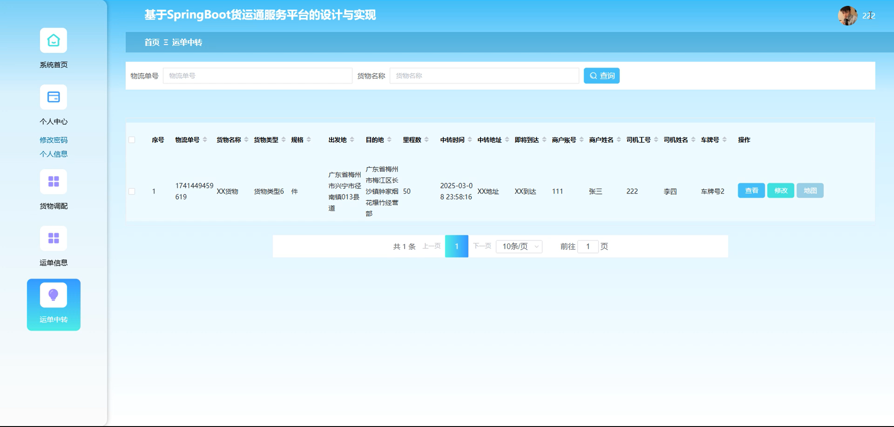

# springbootA442D
springbootA442D货运通服务平台+LW
 
## 查看主页获取源码

### 一、关键词
货物订单、货物调配、运单信息

### 二、作品包含
源码+数据库+设计文档万字+全套环境和工具资源+本地部署教程

### 三、项目技术
前端技术：Html、Css、Js、Vue2.0、Element-ui 
后端技术：Java、SpringBoot2.0、MyBatis

### 四、运行环境（以下版本亲测，其他版本未知，请自测）
开发工具：IDEA/eclipse  + VSCODE

数据库：MySQL5.7（最低要5.7版本）

数据库管理工具：Navicat10以上版本

环境配置软件： JDK1.8 + Maven3.6.3

前端Nodejs：14

浏览器：谷歌浏览器

### 五、项目介绍
项目编号：springbootA442D

货运通服务平台是为运单全流程及运单赔付等功能，以实现货运业务高效管理与协作的服务平台。

角色：管理员、商户、司机

管理员功能：系统首页、个人中心、商户、司机、车辆信息、车辆维修、油卡信息、ETC卡、货物类型、货物订单、货物调配、运单信息、运单中转。

商户功能：系统首页、个人中心、货物订单、货物调配、运单信息、运单中转、运单赔付。

司机功能：系统首页、个人中心、货物调配、运单信息、运单中转。

### 六、运行截图

